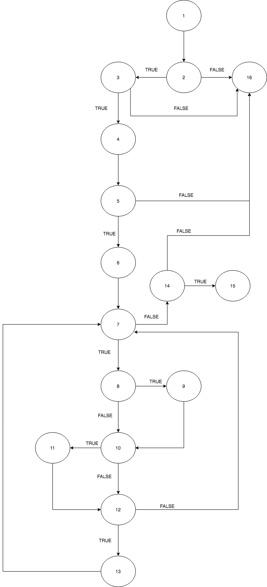

# Втора лабораториска вежба по Софтверско инженерство

## Нина Митевска, бр. на индекс 151517

### Група на код: 

Ја добив групата на код 4

###  Control Flow Graph

Фотографија од control flow graph-от




### Цикломатска комплексност

Цикломатската комплексност изнесува 9, тоа е добиено со помош на формулата: `E - N + 2 * P` каде што E е бројот на линии, а N е бројот на јазли, бројот P е бројот на јазли кои што претставуваат излез од програмата.
Во оваа функција броевите изнесуваат:

- E = 21
- N = 16
- P = 2

```text
21 - 16 + 2 * 2 = 9
```


### Тест случаи според критериумот  Every branch 

1.Кога корисникот има невалидна лозинкa

2.Кога корисникот има валидна лозинка

### Тест случаи според критериумот Multiple Condition

1. Четири случаи со невалидна лозинка
2. Еден случај со валидна лозинка
